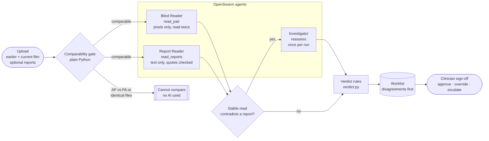
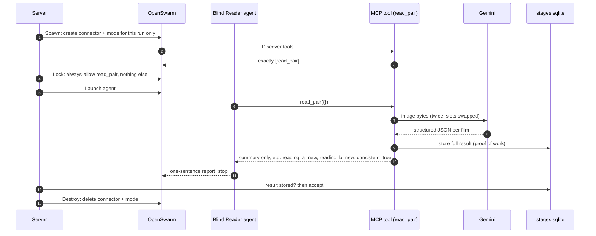
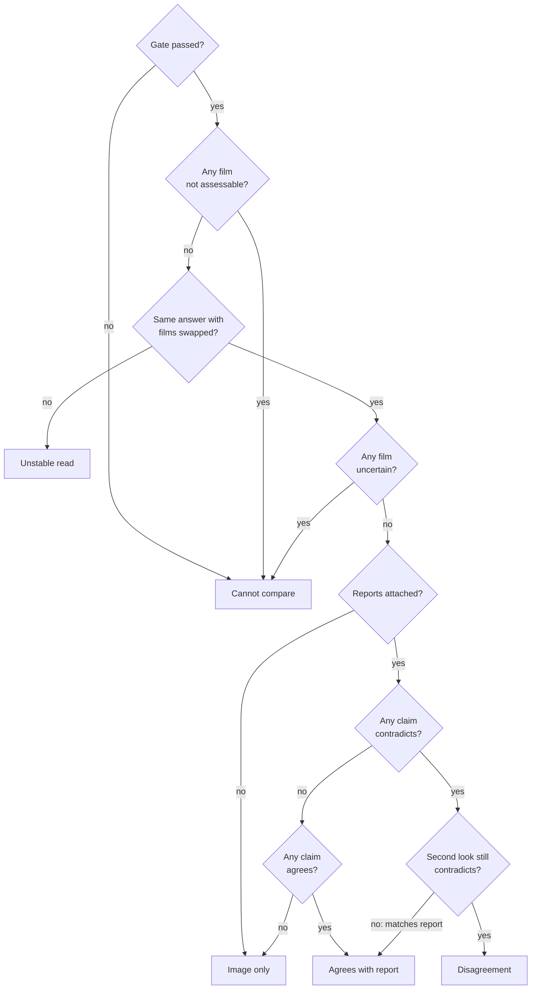

<div align="center">


# Pleural Sight

**Pixels first. Words second. A human decides.**

By Abhishai Ganta, Adnan Barwaniwala, Raj Vansh Bollineni

A second reader for follow-up chest X-rays that reads the images before it is allowed to see the report.

[](https://devpost.com/software/pleural-sight)
[](https://www.canva.com/d/JUOISM5piNh29lJ)


[Devpost](https://devpost.com/software/pleural-sight) · [Pitch deck](https://canva.link/ti8ifvcw4oxem2n) · [Run it](#run-it) · [Demo cases](#demo-cases) · [How it works](#how-it-works)

*Built for the HealthLink Life Sciences Hackathon 2026 by Abhishai Ganta, Adnan Barwaniwala and Raj Vansh Bollineni.*

</div>

> [!WARNING]
> Research prototype. Not for clinical use. Every flag needs clinician review.

---

## Contents

- [Inspiration](#inspiration)
- [What it does](#what-it-does)
- [How it works](#how-it-works)
  - [Keeping the reader blind](#keeping-the-reader-blind)
  - [Testing for position bias](#testing-for-position-bias)
  - [Models observe, code decides](#models-observe-code-decides)
  - [Where SQLite fits](#where-sqlite-fits)
- [Tech stack](#tech-stack)
- [Run it](#run-it) ([macOS](#macos) · [Windows](#windows))
- [Demo cases](#demo-cases)
- [Tests and evaluation](#tests-and-evaluation)
- [Challenges we ran into](#challenges-we-ran-into)
- [What we learned](#what-we-learned)
- [Limits](#limits)
- [What's next](#whats-next)
- [Repository map](#repository-map)

---

## Inspiration

When radiologists read a follow-up chest X-ray, the prior film and its report are usually open beside it. If that report says *"No pleural effusion,"* a slightly blunted costophrenic angle on today's film is easy to dismiss.

The Kim-Mansfield classification of radiology errors names both failures:

| Error | Name | What goes wrong |
|---|---|---|
| Type 7 | Prior examination error | The current film is read without properly comparing it to the prior |
| Type 12 | Satisfaction of report | An earlier report steers what the reader sees |

Most AI tools take the images and the report together, so the model can be anchored the same way a person can. We wanted a system that commits to what it sees in the pixels before anything written can influence it, then sends any conflict to a person.

We called the engine **TimeLens**, since the job is comparing two moments, and named the product **Pleural Sight** after narrowing it to one finding: pleural effusion.

## What it does

Each case is an **earlier** film, a **current** film, and optionally a written report for each.

1. **Gate.** Plain Python rejects pairs that can't be compared: byte-identical files, and AP vs. PA projections (portable AP films spread fluid out and magnify the heart). These return *Cannot compare* without calling a model.
2. **Blind Reader.** Sees the two films as `FILM 1` and `FILM 2`, with no dates and no report, and labels each one *present*, *absent*, *uncertain* or *not assessable*, with evidence.
3. **Report Reader.** Never sees the images. It extracts one effusion claim per report, and each supporting quote must appear verbatim in the report.
4. **Investigator.** Runs only if a stable, definite blind read contradicts a report. It takes one targeted, still report-blind second look at the disputed film.
5. **Verdict.** Ordinary code assigns the status, and the worklist puts the cases that most need a person first.
6. **Sign-off.** A clinician approves, overrides with a required reason, or escalates. Every action is logged.

The worklist order:

```math
\textit{Disagreement} \prec \textit{Cannot compare} \prec \textit{Unstable read} \prec \textit{Image only} \prec \textit{Agrees with report}
```

The workspace syncs both studies in **side-by-side, flicker and swipe** modes. It shows a plain-language conclusion such as *"Possible new fluid in the current study,"* per-study *Sources agree / Sources disagree* cards, and expandable panels for the clinical evidence and the full agent trace. Cases can be uploaded, edited, swapped, deleted and restored.

There are no heatmaps and no confidence percentages, because nothing calibrated sits behind them.

## How it works



### Keeping the reader blind

The agents never handle the data. Each run writes a private manifest with the image paths, report text and gate result, and only the MCP tool process can read it. An agent's whole job is to call its one tool, once, with no arguments.



What that buys us:

- **Image bytes and report text never enter an agent prompt.** The agent only ever sees a short summary.
- **One tool per agent, zero arguments.** The MCP server rejects any arguments and any call from the wrong role, so an injected "also call `read_reports`" fails.
- **Proof of work.** A run only counts as complete when the tool has stored its result. An agent that says "done" without calling the tool fails the run.
- **Nothing left behind.** Connectors and modes are deleted when each agent finishes, and sessions are stopped on cancel.

A headless engine (`direct_workflow.py`) calls the same tools in-process without agents. It handles batch evaluation and is the fallback when OpenSwarm isn't running. Both engines return the same result shape.

### Testing for position bias

Vision models sometimes answer differently depending on which image comes first, so the Blind Reader reads every pair twice. Let $f(x_1, x_2) \to (s_1, s_2)$ be one read of two films, where each $s_i$ is *present*, *absent*, *uncertain* or *not assessable*:

```math
R_A = f(\text{prior}, \text{current}), \qquad R_B = \sigma\big(f(\text{current}, \text{prior})\big)
```

where $\sigma$ maps the second read back to prior/current positions. The read is **stable** only if

```math
R_A^{\text{prior}} = R_B^{\text{prior}} \;\wedge\; R_A^{\text{current}} = R_B^{\text{current}}
```

Otherwise the case is marked *Unstable read*; the two reads are never averaged. A stable read becomes a transition label:

```math
T(s_p, s_c) =
\begin{cases}
\text{absent} & (\text{absent}, \text{absent}) \\
\text{new} & (\text{absent}, \text{present}) \\
\text{resolved} & (\text{present}, \text{absent}) \\
\text{persistent} & (\text{present}, \text{present}) \\
\text{indeterminate} & \text{otherwise}
\end{cases}
```

### Models observe, code decides

`verdict.py` contains no model calls. For a report claim $c$ about study $k$, with blind state $v_k$:

```math
\text{verdict}(c) =
\begin{cases}
\text{no relevant claim} & c = \text{no relevant claim} \\
\text{uncertainty} & v_k \notin \{\text{present},\text{absent}\} \ \lor\ c = \text{uncertain} \\
\text{agreement} & v_k = c \\
\text{contradiction} & \text{otherwise}
\end{cases}
```

The final status follows a fixed order, and the first rule that matches wins:



When the second look sides with the report, the status is *Agrees with report* and both readings stay in the result so the reviewer can see the change. The Investigator runs only after a contradiction from a stable, definite read. The MCP server checks that condition again itself, and a primary key on the stage name lets `reassess` run once per case.

### Where SQLite fits

| Database | Table | Holds |
|---|---|---|
| `runtime/intake.sqlite` | `cases` | Uploaded comparisons: images, views, reports, uploader confirmations |
| | `case_edits` | Swaps, replaced images or reports, soft deletes (for restore) |
| | `runs` | One row per Compare: status, live stage, result, trace, error |
| | `run_inputs` | Frozen snapshot of what each run was given |
| | `signoffs` | Clinician audit log: approve, override (with reason), escalate |
| `runs/<id>/stages.sqlite` | `stages` | The agents' shared blackboard: one row per tool, running → complete or failed |

## Tech stack

| Layer | Tools |
|---|---|
| Agents | OpenSwarm, Model Context Protocol (`mcp`) |
| Vision and text model | Gemini via the Google Gemini API (Google AI Studio keys) |
| Backend | Python, FastAPI, Starlette, Uvicorn, python-multipart |
| Data and validation | Pydantic (strict JSON schemas), SQLite, Pillow, pypdf, httpx |
| Frontend | Vanilla JavaScript, HTML5, CSS3 (no third-party scripts or fonts) |
| Testing | pytest, Node.js (UI progress test) |
| Data | NIH ChestX-ray14 (public, de-identified) |
| Pitch | Canva |

## Run it

**You need:**

- Python 3.10 or newer
- A Gemini API key from [Google AI Studio](https://aistudio.google.com/)
- Optional: the OpenSwarm desktop app, running and signed in, for live agent runs. Its token is found automatically on macOS and Windows. Without it, cases run on the headless engine.

### macOS

```bash
git clone https://github.com/Adnan-Barwaniwala/Pleural-Sight.git
cd Pleural-Sight
python3 -m venv .venv
source .venv/bin/activate
pip install -r requirements.txt
cp .env.example .env
```

Open `.env`, set `GEMINI_API_KEY=your-key`, then start the server:

```bash
python server.py
```

Open http://127.0.0.1:8765 for the landing page, or http://127.0.0.1:8765/workspace to go straight to the app. If port 8765 is busy:

```bash
TIMELENS_PORT=8766 python server.py
```

### Windows

In PowerShell:

```powershell
git clone https://github.com/Adnan-Barwaniwala/Pleural-Sight.git
cd Pleural-Sight
python -m venv .venv
.venv\Scripts\pip install -r requirements.txt
Copy-Item .env.example .env
notepad .env
```

Set `GEMINI_API_KEY=your-key`, save, then start the server:

```powershell
.venv\Scripts\python server.py
```

Open http://127.0.0.1:8765. If port 8765 is busy:

```powershell
$env:TIMELENS_PORT=8766; .venv\Scripts\python server.py
```

### Settings

All settings go in `.env` or the environment.

| Variable | Default | Purpose |
|---|---|---|
| `GEMINI_API_KEY` | none | Gemini calls made inside the MCP tools |
| `GEMINI_API_KEYS` | none | Optional comma-separated key pool, rotated on HTTP 429 |
| `TIMELENS_GEMINI_MODEL` | `gemini-3.5-flash-lite` | Vision and text model |
| `TIMELENS_GEMINI_FALLBACKS` | `gemini-3.5-flash,gemini-3.7-flash,gemini-3.6-flash,gemini-3.8-flash,gemini-3.1-flash-lite` | Used only on 429/503; the trace shows which model answered |
| `TIMELENS_OPENSWARM_MODEL` | `gemini-3.8-flash` | Model that drives the OpenSwarm agents |
| `TIMELENS_RESPONSE_CACHE` | `1` | Identical requests reuse the stored answer; `0` forces a fresh call |
| `TIMELENS_PORT` | `8765` | Local port |
| `OPENSWARM_URL` | `http://127.0.0.1:8324` | OpenSwarm local API |
| `OPENSWARM_TOKEN_PATH` | auto | Override the OpenSwarm token location |

> [!TIP]
> **Rate limits.** A key whose Cloud project has no billing is on the free tier: 20 requests per model per day. An image-only case uses 2 requests, a case with reports 3 to 5, and the evaluation about 100. A consumer Google AI Pro subscription does not raise API limits. Turning on billing for the key's project in AI Studio removes the limit for well under a cent per case. The app also uses a key pool, model fallbacks, a response cache and cached replays, so rehearsed demo cases replay instantly.

## Demo cases

The workspace ships with four cases. The same files, plus extra upload sets and a folder of files that should be rejected, are in [`demo-test-cases/`](demo-test-cases). Five harder report-reading cases are in [`extended-test-dataset/`](extended-test-dataset).

| # | Case | Reports | Expected result |
|---|---|---|---|
| 1 | No fluid, then fluid | Earlier: clear · Current: new effusions | New fluid in the current study; both reports agree |
| 2 | Images only | none | Fluid in both X-rays; the report step is skipped |
| 3 | Front and back views | none | Not compared (PA vs. AP), instantly, with no AI used |
| 4 | Report disagrees | Earlier: large effusion · Current: "clear" | Fluid in both; the current card shows *Sources disagree* and the second look runs |

Full steps and expected results are in [TEST-CASES.md](TEST-CASES.md). The three-minute demo script is in [DEMO.md](DEMO.md).

## Tests and evaluation

```bash
# macOS (inside the activated venv)
python -m pytest -q
python scripts/run_eval.py      # writes data/eval/results.json; about 100 Gemini requests
```

```powershell
# Windows
.venv\Scripts\python -m pytest -q
.venv\Scripts\python scripts\run_eval.py
```

The evaluation runs a 19-pair NIH pilot set (16 PA-to-PA pairs, four per transition, plus 3 AP-vs-PA) against the pipeline and three single-call baselines:

| Baseline | Prompt |
|---|---|
| A, naive | "Compare these and label the change." |
| B, strong | A careful radiologist prompt that may answer `cannot_compare` |
| C, anchored | Both films plus the current report, to measure anchoring directly |

## Challenges we ran into

**Agents that finished without working.** Our first full runs reported `completed` in OpenSwarm, but no tool result had been stored; one agent described what it planned to do and stopped. Because only a stored MCP result counts as proof, the run failed instead of using a chat answer. We tightened the role prompt, set the one tool to always allow, and check at discovery time that each connector exposes exactly that tool.

**The free tier.** At 20 requests per model per day and 2 requests per image-only case,

```math
\left\lfloor \frac{20}{2} \right\rfloor = 10 \text{ image-only cases per model per day}
```

before anyone rehearses the demo. After an HTTP 429 mid-test we added a six-model fallback chain, a rotating key pool, a response cache keyed on a SHA-256 of the request, and error messages that say how to fix the problem.

**The earlier report kept vanishing.** The Report Reader treated the earlier study's report as history and returned no claim. We had to state that a report's statements about its own study are claims for that study, and only mentions of even older exams are history.

**A false "agree."** The UI said *Images and reports agree* whenever nothing was contradicted, including hedged reports and reports that never mention fluid. The summary now comes from every claim's verdict, and uncertainty or silence shows a neutral, needs-review state.

**Cancellation races.** Cancelling during an OpenSwarm request could still create a connector or start an agent. Every create and launch call is wrapped in `asyncio.shield`: on cancel we wait for the response, delete what was created and stop any session. A marker file makes the tools reject late results.

**Noisy labels.** NIH labels are mined from reports by NLP, so they carry the same anchoring bias we were trying to catch. The app shows them as reference labels and never puts them in a prompt.

## What we learned

- Two narrow readers that can't see each other's inputs, joined by a few lines of `if` statements, were easier to debug and audit than one prompt that sees everything.
- Once Gemini only had to fill a strict schema, deciding what counts as a disagreement became ordinary, unit-tested code.
- An agent saying it finished means nothing until its tool has stored a result.
- Caching, fallbacks and replays decided whether we could demo at all.
- *"No fluid detected in either study"* belongs in the headline. `absent_both` belongs one click deeper.

## Limits

- **Small pilot.** With $n = 19$, a 95% interval on an accuracy near 50% has a half-width of $1.96\sqrt{0.25/19} \approx 0.22$. The pilot shows how the system behaves; it can't measure accuracy.
- Gemini readings vary between runs. The order-swap check exists to surface that.
- No PACS integration, login or authenticated reviewer identity.
- OpenSwarm still exposes built-in tools at session level. The data boundary is enforced by keeping raw inputs inside the MCP tools.
- All demo reports were written by the team for testing.

## What's next

- [ ] A held-out, clinician-annotated evaluation with patient-level separation and confidence intervals
- [ ] Suitability checks that send non-chest or low-quality images to *not assessable*
- [ ] More findings: pneumothorax, cardiomegaly, line and tube position
- [ ] DICOM and PACS integration, so view, chronology and identity come from metadata
- [ ] Authenticated sign-off and OCR for scanned reports
- [ ] Calibration, so any number we eventually show means something

## Repository map

```text
.
├── server.py               FastAPI worklist + review API, sign-off log, replays, evaluation
├── pipeline.py             One investigation, shared by both engines
├── openswarm_workflow.py   OpenSwarm engine: spawn, lock, run, destroy
├── direct_workflow.py      Headless engine: same tools, no agents
├── analysis_mcp.py         Run-bound, one-tool MCP server + stages blackboard
├── gemini_direct.py        Gemini calls: swapped blind read, reassessment, report extraction, baselines
├── verdict.py              Status rules (no model calls)
├── cases.py                Case catalog + comparability gate
├── inputs.py               Upload validation for images and reports
├── ui_adapter.py           Plain-language wording for the UI
├── static/                 Landing page + workspace UI
├── data/                   NIH images, metadata, case catalogs
├── demo-test-cases/        Upload-ready demo folders (incl. files that should be rejected)
├── extended-test-dataset/  Five harder report-reading cases
├── scripts/                Data download, case building, test packs, evaluation
├── tests/                  pytest suite + UI progress test
└── reference/original/     Archival first prototype; do not run
```

---

<div align="center">

[Devpost](https://devpost.com/software/pleural-sight) · [Pitch deck](https://www.canva.com/d/JUOISM5piNh29lJ) · NIH ChestX-ray14 images are public and de-identified.

<sub>Research prototype. Not for clinical use. Every flag needs clinician review.</sub>

</div>


**A second-reader worklist for follow-up chest X-rays that reads the images before it is allowed to see the report.**

TimeLens targets two named radiology error types (Kim–Mansfield): *type 7, prior examination error* (the current film is read without the prior) and *type 12, satisfaction of report* (an earlier report anchors the read). Every case is a prior + current pair. The image reader cannot access any report. Disagreements rise to the top of the worklist for clinician sign-off. Pleural effusion only. Research prototype — not for clinical use.

## Run it (Windows)

```powershell
python -m venv .venv
.venv\Scripts\pip install -r requirements.txt
# .env (Git-ignored) must contain: GEMINI_API_KEY=...
.venv\Scripts\python server.py
```

Open http://127.0.0.1:8765. If port 8765 is taken, set `TIMELENS_PORT=8766` first. For live agent runs, the OpenSwarm desktop app must be running and signed in (its token is discovered automatically). Without OpenSwarm, cases still run with the **headless** engine. Without a key, cached **replays** still display.

| Variable | Default | Purpose |
|---|---|---|
| `GEMINI_API_KEY` | — | Direct Gemini calls made inside the MCP tools |
| `TIMELENS_GEMINI_MODEL` | `gemini-3.5-flash-lite` | Vision/text model |
| `TIMELENS_GEMINI_FALLBACKS` | `gemini-3.5-flash,gemini-3.7-flash,gemini-3.6-flash,gemini-3.8-flash,gemini-3.1-flash-lite` | Used only on 429/503 capacity errors; the model that answered is shown in the trace |
| `TIMELENS_OPENSWARM_MODEL` | `gemini-3.8-flash` | Model that drives the OpenSwarm agents |
| `GEMINI_API_KEYS` | — | Optional comma-separated pool (keys from different Cloud projects), rotated on 429 |
| `TIMELENS_RESPONSE_CACHE` | `1` | Identical requests reuse the stored answer (trace shows *cached response*); set `0` for a fresh live call |
| `TIMELENS_PORT` | `8765` | Local port |

## Rate limits

Google AI Pro (the consumer Gemini subscription) does **not** apply to the Gemini API. An API key whose Cloud project has no billing is on the free tier: **20 requests per model per day**. One live case uses 3–4 requests and the evaluation about 100. Fix: in AI Studio → API keys, **set up billing** on the key's project (Tier 1, about a fraction of a cent per case). Mitigations built in: a key pool (`GEMINI_API_KEYS`), model fallbacks, a local response cache, and cached replays.

## How a case is investigated

1. **Comparability gate** (server code, before any model call). AP-vs-PA projection mismatch or byte-identical files → *Cannot compare*.
2. **Blind Reader** (OpenSwarm agent → `read_pair`). Two independent Gemini reads, with the films' slots swapped and chronology withheld. Positions are mapped back in code. If the answers differ → *Unstable read*.
3. **Report Reader** (OpenSwarm agent → `read_reports`, in parallel). Sees report text only. Every supporting quotation is verified verbatim in code.
4. **Investigator** (OpenSwarm agent → `reassess`). Runs only if the stable blind read contradicts the report: one targeted, still report-blind second look, enforced once per run by the server.
5. **Status** (`verdict.py`, plain Python). The statuses are *Disagreement*, *Cannot compare*, *Unstable read*, *Image only* and *Agrees with report*.
6. **Sign-off.** A clinician approves, overrides (a reason is required) or escalates. Each action is logged in SQLite.

Each agent gets a fresh per-run MCP connector exposing exactly **one** no-argument tool. The MCP server rejects cross-role calls. Image bytes and report text never enter OpenSwarm prompts: the tool sends them straight to Gemini and returns only structured findings. The run's stage table is the shared blackboard between agents. Connectors and modes are deleted when each agent finishes. The headless engine (`direct_workflow.py`) calls the same tools without agents.

| File | Role |
|---|---|
| `server.py` | FastAPI worklist/review API, sign-off log, replay and evaluation endpoints |
| `pipeline.py` | One investigation, shared by both engines |
| `openswarm_workflow.py` / `direct_workflow.py` | OpenSwarm agent engine / headless engine |
| `analysis_mcp.py` | Run-bound, role-restricted MCP tools |
| `gemini_direct.py` | Tool-free Gemini calls (swapped blind read, reassessment, report extraction, eval baselines) |
| `verdict.py` / `cases.py` | Status rules / case catalog and comparability gate |
| `static/` | Workspace UI (case list, synced image viewer with side-by-side/flicker/swipe, live progress, evidence cards) |
| `ui_adapter.py` | Presents pipeline results to the UI in plain language |

## Data

NIH ChestX-ray14 (public, de-identified). Labels, views and follow-up order come from `data/nih/Data_Entry_2017_v2020.csv`. `scripts/fetch_nih_cases.py` streams only the 37 needed films from NIH's archive; `scripts/build_cases.py` writes `data/cases.json`. NIH labels are report-mined and noisy. They are shown as *reference* labels and never enter a model prompt.

Demo slots: **A** new effusion (PA→PA) · **B** AP vs PA (expected *Cannot compare*) · **C** same films as A with a synthetic report that misses the effusion · **D** persistent effusion with an agreeing synthetic report · **E** near-duplicate control (cropped/brightened copy). The pilot set has 19 pairs: 16 PA→PA (4 per label) and 3 AP-vs-PA.

## Tests and evaluation

```powershell
.venv\Scripts\python scripts\run_eval.py    # pilot results in data\eval\results.json (needs about 100 Gemini requests)
.venv\Scripts\python -m pytest -q
```

## Limits

- Small pilot: behaviour, not accuracy (roughly ±20 points).
- Gemini readings vary between runs. The order-swap check exists to surface that variance.
- No PACS, login or authenticated reviewer identity.
- OpenSwarm still exposes built-in tools at session level. The data boundary is enforced by keeping raw inputs inside the MCP tools.
- `reference/original` is archival source; do not run it.
