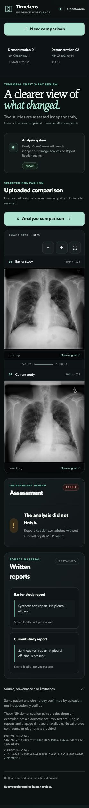

# TimeLens — functionality and failure report

**Review date:** October 3, 2026 (America/Los_Angeles)
**Local checkout:** `/Users/rajvanshbollineni/Documents/Codex/timelens`
**Website:** http://127.0.0.1:8765
**Scope:** Browser exploration, existing automated tests, live image-only analysis, live image-and-report analysis, and source review. No source fixes were applied.

## Overall result

The viewing and intake workflows worked in the exercised paths. All 19 existing automated tests passed. Live image-only analysis completed, but two attempts at the image-and-report workflow failed. An independent live report-extraction request was blocked by Gemini HTTP 429. Diagnostic accuracy and end-to-end report accuracy therefore remain unverified.

Automated tests predominantly use mock model responses and mock orchestration. Passing them establishes selected software behaviors, not clinical correctness or reliable live agent execution.

## Test results

| Check | Outcome | Evidence and limits |
| --- | --- | --- |
| `.venv/bin/python -m pytest -q` | Passed | 19 passed in 2.87 seconds; no automated test failures. |
| `node --check static/app.js` | Passed | JavaScript syntax check produced no errors. |
| Image zoom, fullscreen, reset, sync toggle | Passed | Browser controls changed the visible viewer state as expected. Drag/pan behavior was not separately verified. |
| Upload public PNG pair and paste two synthetic reports | Passed | Comparison saved with correct earlier/current report scopes and image dimensions. |
| Same-patient and chronology controls | Passed in exercised path | Both checked before upload; automated tests also cover missing confirmations. |
| Reload persistence | Passed in exercised path | Saved comparison, reports, and failed-run state restored; completed demo assessment was also restored during exploration. |
| Provenance disclosure | Passed | Expanded panel displayed uploader assertions, limitations, and SHA-256 values. |
| Live image-only demo | Passed operationally | Demo 1 completed with absent/absent effusion states and the report role skipped. This is not a verified diagnostic result. |
| Live image-and-report attempt 1 | Failed | Image Analyst completed without an authoritative MCP result. |
| Live image-and-report attempt 2 | Failed | Report Reader completed without an authoritative MCP result. |
| Direct Gemini synthetic-report extraction | Blocked | HTTP 429; no report predictions returned. |
| Clinical image accuracy | Not evaluated | No clinician-reviewed reference labels or validated evaluation set supplied. |

## Confirmed failure 1 — image-and-report orchestration

**Priority:** High; prevents completion of a core workflow.

**Input:** The public demo images `00000001_000.png` and `00000001_001.png`, uploaded as a new comparison, with these deliberately synthetic reports:

- Earlier: `Synthetic test report: No pleural effusion.`
- Current: `Synthetic test report: A pleural effusion is present.`

The goal was to check agreement for the earlier study and disagreement for the current study if image analysis again returned absent/absent. Synthetic report assertions are not ground truth for the images.

**Expected:** Both role tools submit structured results; report quotes match the supplied text; the backend compares each report claim with its assigned image; a disagreement is visibly flagged.

**Observed:**

| Attempt | Run ID | Stored error |
| --- | --- | --- |
| 1 | `c366314300114be1a31b15fcfd9ae6ba` | `Image Analyst completed without submitting its MCP result.` |
| 2 | `e75c2afb7e8540c7bebe3108389164dd` | `Report Reader completed without submitting its MCP result.` |

Comparison ID: `ee165df3c1e34c649629552b2ff77f07`.

**Evidence:** Browser failure states and records in `runtime/intake.sqlite`. The detecting guard is in `openswarm_workflow.py:110–112`: a completed session is rejected when `worker.get(tool_name)` returns no result.

**What is known:** An agent session reported completion without the required persisted result. The guard correctly failed the run rather than using an unverified conversational answer.

**What is not known:** Session messages were not inspected, so the underlying cause is unresolved. Tool activation, discovery, invocation, permission handling, model behavior, and result persistence are candidates to investigate; none is established as the cause. The later HTTP 429 does not prove these two failures were caused by quota.

**Suggested solution:**

1. Preserve sanitized session status, role, tool-discovery state, invocation attempts, tool errors, and stage-persistence status on failure. Exclude credentials and raw private inputs from logs.
2. Inspect the failed sessions to determine whether the tool was unavailable, skipped, rejected, failed, or completed without persisting its output.
3. Verify each role's exact tool name and supported OpenSwarm activation flow before launching it. Prefer a supported mandatory-tool mechanism if OpenSwarm offers one; prompt wording alone cannot guarantee invocation.
4. Keep the persisted MCP result as the authoritative completion requirement.
5. Check sibling-task lifecycle when one concurrent role fails. Ensure cleanup does not remove a connector while its other task is still running; explicitly await or safely terminate outstanding role work using supported APIs.
6. Offer explicit stage-aware recovery. Reuse completed immutable stages where appropriate and require deliberate retry for a stage that may incur another paid request.

**Acceptance checks:** Repeated image-only and two-role runs complete; every expected role has a valid persisted result; synthetic disagreement is flagged; injected missing-tool-result failures produce useful diagnostics; cleanup leaves no active task using a removed connector.

## Confirmed failure 2 — Gemini HTTP 429

**Priority:** High for availability; configuration/provider issue until diagnosed.

**Test:** Called `gemini_direct.read_reports()` independently with five synthetic examples covering absence, presence, uncertainty, no relevant claim, and a historical effusion resolved in the current study.

**Expected states:** `absent`, `present`, `uncertain`, `no_relevant_claim`, `absent`.

**Observed:** `Gemini returned HTTP 429; check key, model access and quota.` No structured result was returned, so none of these semantic cases received a live pass/fail verdict.

**Relevant code:** `gemini_direct.generate()` reports non-200 responses through `ModelError` and intentionally does not automatically retry.

**Suggested solution:** Check the API project's model-specific rate limits, quota, and billing status. Capture an allowlisted provider error code and retry timing where available, without exposing keys or raw inputs. Present a specific quota/rate-limit message and an explicit retry action. Use bounded backoff only for a diagnosed transient limit; do not indefinitely retry exhausted quota or silently switch models.

**Acceptance checks:** Simulated rate-limit and quota responses have distinct actionable messages; any retry respects provider timing and request limits; the five synthetic examples are rerun successfully when access permits, with exact quote and scope validation.

## Code-review issue 3 — misleading agreement summary

**Priority:** High; could misrepresent uncertain evidence.
**Status:** Confirmed from control flow; not reproduced with a completed live uncertainty case.

In `static/app.js:22`, `showResult()` says the image assessment and report statements agree whenever there are claims and none is a contradiction. Backend verdicts `uncertainty` and `no_relevant_claim` therefore also enter this agreement branch. The success icon is likewise based only on whether a contradiction exists.

**Suggested solution:** Derive the summary from all claim verdicts. Distinguish contradiction, uncertainty, no relevant claim, partial agreement, and complete agreement. Use a neutral or review-required visual state for unresolved evidence. Say “agree” only when the relevant claims actually have agreement verdicts.

**Acceptance checks:** Render completed result fixtures for every verdict and mixed-verdict combination. Neither uncertainty nor no-relevant-claim cases may display blanket agreement or an unqualified success indication.

## Code-review issue 4 — limited chest-image eligibility checks

**Priority:** Medium; input suitability gap.
**Status:** Confirmed absence of an explicit eligibility check; no live non-chest-image test was run.

`inputs.py:10–27` checks PNG/JPEG format, size, dimensions, and successful decoding. These checks do not establish that an image is a chest radiograph, that the pair belongs to the same patient, or that the study order is correct. Patient identity and chronology currently depend on uploader confirmations.

**Suggested solution:** Keep existing file checks and add explicit image suitability assessment, with separate states for non-chest images, unsuitable views, and insufficient quality. Route unsuitable or uncertain inputs to `not_assessable` rather than forcing a presence/absence answer. Retain uploader confirmations and clearly describe their limits. Do not describe a model-based eligibility check as definitive validation without evaluating it.

**Acceptance checks:** Exercise non-medical images, other body regions, cropped/low-quality chest images, and valid chest radiographs. Unsuitable inputs receive a clear explanation without a confident effusion finding.

## Evaluation gap 5 — accuracy is not established

**Priority:** High before making accuracy claims.

The image-only demo reported absence of pleural effusion in both studies. There are no independently verified clinical labels in the tested repository assets, so that result cannot be scored as diagnostically correct. Four development pairs and mocked model tests are not an accuracy evaluation. Live report extraction was also blocked or failed before comparison.

**Suggested solution:** Build a held-out, appropriately authorized, clinician-reviewed evaluation set covering positive and negative effusion cases, difficult image quality, uncertain findings, temporal transitions, and report negation/history/conflicts. Preserve patient-level separation between development and evaluation. Measure image sensitivity/specificity, report extraction and scope accuracy, uncertainty handling, and end-to-end workflow completion separately. Report sample sizes, uncertainty intervals, and failure cases. Evaluate any model or prompt change again.

**Acceptance checks:** A reproducible evaluation manifest, independent reference annotations, explicit scoring rules, and a results report exist. Operational failures are counted separately from classification errors and are not silently excluded.

## Other observed errors and limitations

- Initial dependency installation failed because network access was unavailable. After network permission was granted, the same pinned requirements installed successfully. No dependency changes were needed.
- A later command-line request to the local API was denied by the execution sandbox. Stored SQLite records and browser observations provided the needed evidence instead. This was an inspection-tool restriction, not a website failure.
- Several exploratory commands referred to nonexistent files (`data/cases.json`, `data/demo_pairs.json`, `comparison.py`, and `tests/test_analysis.py`), and one stage-database query used a nonexistent `error` column. Those were inspection mistakes, not failing application tests.
- A browser inspection of file-input metadata and an attempt to send a key to a non-focusable heading failed. Actual file upload and screenshot capture subsequently succeeded; these were automation errors, not application failures.
- TXT/selectable-text PDF support exists, but this browser session only exercised pasted report text and PNG uploads. Scanned-PDF rejection is covered by an existing automated test. JPEG and real selectable-text PDF uploads were not independently exercised in the browser.
- DICOM support, OCR for scanned reports, general disease detection, severity measurement, calibrated confidence, reviewer acceptance/edit actions, and cancellation are outside the implemented scope or remain unimplemented. These are limitations, not newly failed tests.
- Mobile layouts, browser compatibility, load/concurrency stress, accessibility audit, and exhaustive failure recovery were not evaluated.

## Recommended implementation order

1. Diagnose missing MCP outputs and make failed-stage evidence actionable.
2. Resolve Gemini quota/rate-limit access and rerun synthetic report tests.
3. Correct agreement/uncertainty summaries with focused rendering tests.
4. Add and evaluate image suitability handling.
5. Run a clinician-reviewed accuracy evaluation before presenting diagnostic-performance claims.

## Screenshot evidence

The screenshot shows the second failed image-and-report attempt and the saved synthetic report inputs.

